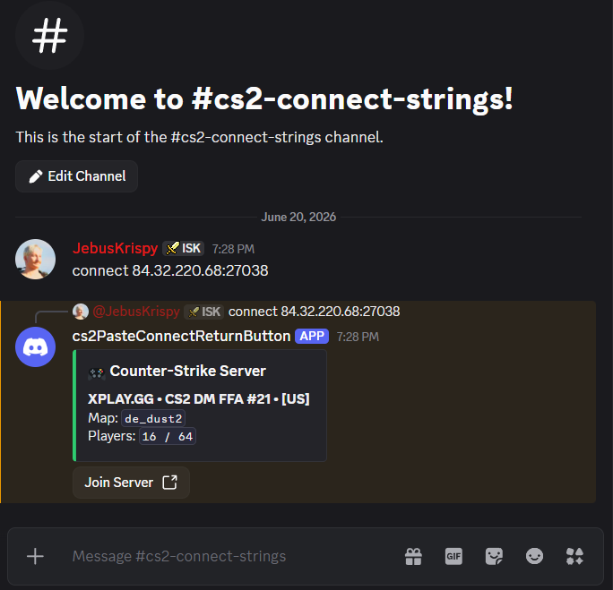
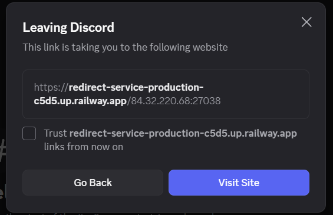
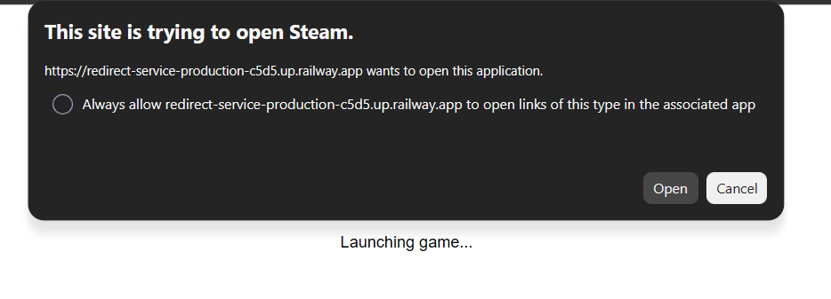
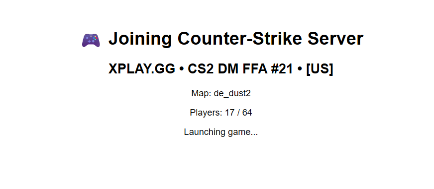

# Discord Gaming Server String To Join Button

A Discord bot that automatically detects Counter-Strike 2 server connect strings, queries live server information, and converts them into one-click join buttons.

### Looks like this:



## Why?

Joining custom CS2 servers is often more cumbersome than it should be.

Typical workflow:

```text
Someone sends:
connect pathfinder.dathost.net:26142; password Refrag55536

You:
1. Copy the string
2. Launch CS2
3. Open the developer console
4. Paste the command
5. Press Enter
```

This bot reduces that process to:

```text
Someone sends a server string
↓
Bot generates a server card
↓
Click Join Server
↓
CS2 launches and connects
```

---

## Features

### Automatic Connect String Detection

Detects:

```text
connect 169.150.232.56:25575
```

```text
connect davies.dathost.net:25575; password Refrag55610
```

### Raw IP Detection

Detects:

```text
169.150.232.56:25575
```

### Hostname Detection

Detects:

```text
davies.dathost.net:25575
```

### Live Server Information

Queries the CS2 server and displays:

* Server Name
* Current Map
* Player Count

Example:

```text
🎮 Refrag Practice Server

Map: de_mirage
Players: 4 / 10
```

### One-Click Join Button

Generates a Join Server button that launches Counter-Strike 2 using Steam protocol handlers.

### DNS Resolution

Automatically resolves hostnames to IP addresses before launching CS2.

Example:

```text
davies.dathost.net:25575
```

becomes:

```text
169.150.232.56:25575
```

for improved compatibility.

---

## Example

User posts:

```text
connect davies.dathost.net:25575; password Refrag55610
```

Bot responds:

```text
🎮 Refrag Practice Server

Map: de_mirage
Players: 4 / 10
[ Join Server ]
```


### Clicking the button opens a redirect browser tab, click open to allow the bot to continue(check the box to avoid having to click through this in the future).



### In the browser a steam connect message will popup, click open to allow the bot to open steam, open counterstrike, and connect to the server(check the "always allow..." to avoid having to click through this in the future).



### Current version of the redirect tab:




---

## Requirements for testing this locally

* Python 3.10+
* Discord Bot Token
* Steam
* Counter-Strike 2

---

## Installation

Clone the repository:

```bash
git clone https://github.com/rneyrinck/DiscordGamingServerStringToJoinButton.git
cd DiscordGamingServerStringToJoinButton
```

Create a virtual environment:

```bash
python -m venv ven
```

Activate the environment:

Windows:

```bash
ven\Scripts\activate
```

Linux / Mac:

```bash
source ven/bin/activate
```

Install dependencies:

```bash
pip install -r requirements.txt
```

---

## Configuration

Create a `.env` file:

```env
DISCORD_TOKEN=YOUR_DISCORD_BOT_TOKEN
```

Update the base URL in `bot.py`:

```python
BASE_URL = "http://localhost:5000"
```

Replace with your deployed redirect server URL when hosting publicly.

---

## Running the Bot

Start the redirect server:

```bash
python redirect_server.py
```

In another terminal:

```bash
python bot.py
```

---

## Project Structure

```text
.
├── bot.py
├── redirect_server.py
├── requirements.txt
├── .gitignore
└── README.md
```

---

## Supported Formats

### Connect Command

```text
connect 121.127.41.37:26200
```

### Connect Command With Password

```text
connect davies.dathost.net:25575; password Refrag55610
```

### Raw IP

```text
121.127.41.37:26200
```

### Raw Hostname

```text
davies.dathost.net:25575
```

---

## Current Status

Project is functional and supports:

* Connect string detection
* Hostname detection
* IP detection
* Server information querying
* DNS resolution
* Steam launch links
* One-click CS2 joining

---

## Future Ideas

* Slash commands
* Server favorites
* Server history
* Community server discovery
* Matchmaking integrations
* Refrag and PopFlash specific enhancements
* Rich player list previews
* Public hosted join service

---

## License

MIT
